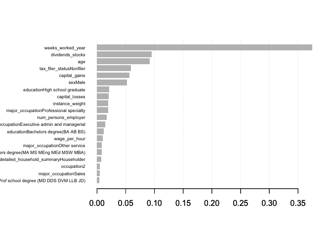

Introduction
============

In this analysis, we use a us census dataset containing detailed but anonymised information for approximately 300,000 people. We will use this data to create a model to try to "predict" who is earning more or less than $50,000 / year.

We will detail the different steps of the analysis. In the first part, we realize a quick audit of the data, then we build the model based on the training set and finally, we will confront our model to "reality" using the test set.

This analysis is entirely realized in R. First, let's set the environment

``` r
require(data.table)
require(dplyr)
require(ggplot2)
require(xgboost)
require(Matrix)
require(DiagrammeR)
require(reshape2)
require(gridExtra)
require(lazyeval)
require(caret)
require(Metrics)
require(scales)

source("utilities/plot_utilities.R")
source("utilities/metrics_utilities.R")
```

Data Exploration
================

In this part I carry out a quick audit of the training data.

Load Data
---------

First, I load the training data and make sure that all the categorical variables are indeed factors.

``` r
train_data <- data.table::fread(input = "data/census_income_learn.csv", header = F, sep = ",")

colnames <- c("age", "class_worker", "industry", "occupation", "education",  "wage_per_hour",
                       "enrolled_edu_inst_last_wk", "marital_status", "major_industry", "major_occupation",
                       "race", "hispanic_origin", "sex", "labor_union", "unemployment_reason",
                       "full_part_employment", "capital_gains", "capital_losses", "dividends_stocks",
                       "tax_filer_status", "region_previous_residence", "state_previous_residence", 
                       "detailed_family_stat", "detailed_household_summary", "instance_weight",
                       "migration_code_change_msa", "migration_code_change_reg", "migration_code_move_reg",
                       "same_house_1_ago", "migration_prev_res_sunbelt", "num_persons_employer", 
                       "family_members_under_18", "father_country_birth", "mother_country_birth", 
                       "country_birth", "citizenship", "own_business_self_employed", 
                       "questionnaire_veteran_admin", "veteran_benefits", "weeks_worked_year", "year", 
                       "target"
)
names(train_data) <- colnames

categorical_vars <- c("class_worker", "industry", "occupation", "education",
                      "enrolled_edu_inst_last_wk", "marital_status", "major_industry", "major_occupation",
                      "race", "hispanic_origin", "sex", "labor_union", "unemployment_reason",
                      "full_part_employment",
                      "tax_filer_status", "region_previous_residence", "state_previous_residence", 
                      "detailed_family_stat", "detailed_household_summary", "migration_code_change_msa",
                      "migration_code_change_reg", "migration_code_move_reg", "same_house_1_ago",
                      "migration_prev_res_sunbelt", "family_members_under_18",
                      "father_country_birth", "mother_country_birth", "country_birth", "citizenship",
                      "own_business_self_employed", "questionnaire_veteran_admin", "veteran_benefits", 
                      "year", "target"
)
train_data <- train_data %>%
     mutate_each_(funs(as.factor(.))
                  , categorical_vars)

summary(train_data)
```

    ##       age                                class_worker       industry     
    ##  Min.   : 0.00   Not in universe               :100245   0      :100684  
    ##  1st Qu.:15.00   Private                       : 72028   33     : 17070  
    ##  Median :33.00   Self-employed-not incorporated:  8445   43     :  8283  
    ##  Mean   :34.49   Local government              :  7784   4      :  5984  
    ##  3rd Qu.:50.00   State government              :  4227   42     :  4683  
    ##  Max.   :90.00   Self-employed-incorporated    :  3265   45     :  4482  
    ##                  (Other)                       :  3529   (Other): 58337  
    ##    occupation                          education     wage_per_hour    
    ##  0      :100684   High school graduate      :48407   Min.   :   0.00  
    ##  2      :  8756   Children                  :47422   1st Qu.:   0.00  
    ##  26     :  7887   Some college but no degree:27820   Median :   0.00  
    ##  19     :  5413   Bachelors degree(BA AB BS):19865   Mean   :  55.43  
    ##  29     :  5105   7th and 8th grade         : 8007   3rd Qu.:   0.00  
    ##  36     :  4145   10th grade                : 7557   Max.   :9999.00  
    ##  (Other): 67533   (Other)                   :40445                    
    ##          enrolled_edu_inst_last_wk                         marital_status 
    ##  College or university:  5688      Divorced                       :12710  
    ##  High school          :  6892      Married-A F spouse present     :  665  
    ##  Not in universe      :186943      Married-civilian spouse present:84222  
    ##                                    Married-spouse absent          : 1518  
    ##                                    Never married                  :86485  
    ##                                    Separated                      : 3460  
    ##                                    Widowed                        :10463  
    ##                            major_industry  
    ##  Not in universe or children      :100684  
    ##  Retail trade                     : 17070  
    ##  Manufacturing-durable goods      :  9015  
    ##  Education                        :  8283  
    ##  Manufacturing-nondurable goods   :  6897  
    ##  Finance insurance and real estate:  6145  
    ##  (Other)                          : 51429  
    ##                        major_occupation 
    ##  Not in universe               :100684  
    ##  Adm support including clerical: 14837  
    ##  Professional specialty        : 13940  
    ##  Executive admin and managerial: 12495  
    ##  Other service                 : 12099  
    ##  Sales                         : 11783  
    ##  (Other)                       : 33685  
    ##                           race                         hispanic_origin  
    ##  Amer Indian Aleut or Eskimo:  2251   All other                :171907  
    ##  Asian or Pacific Islander  :  5835   Mexican-American         :  8079  
    ##  Black                      : 20415   Mexican (Mexicano)       :  7234  
    ##  Other                      :  3657   Central or South American:  3895  
    ##  White                      :167365   Puerto Rican             :  3313  
    ##                                       (Other)                  :  4221  
    ##                                       NA's                     :   874  
    ##      sex                  labor_union                unemployment_reason
    ##  Female:103984   No             : 16034   Job leaver           :   598  
    ##  Male  : 95539   Not in universe:180459   Job loser - on layoff:   976  
    ##                  Yes            :  3030   New entrant          :   439  
    ##                                           Not in universe      :193453  
    ##                                           Other job loser      :  2038  
    ##                                           Re-entrant           :  2019  
    ##                                                                         
    ##                          full_part_employment capital_gains    
    ##  Children or Armed Forces          :123769    Min.   :    0.0  
    ##  Full-time schedules               : 40736    1st Qu.:    0.0  
    ##  Not in labor force                : 26808    Median :    0.0  
    ##  PT for non-econ reasons usually FT:  3322    Mean   :  434.7  
    ##  Unemployed full-time              :  2311    3rd Qu.:    0.0  
    ##  PT for econ reasons usually PT    :  1209    Max.   :99999.0  
    ##  (Other)                           :  1368                     
    ##  capital_losses    dividends_stocks                      tax_filer_status
    ##  Min.   :   0.00   Min.   :    0.0   Head of household           : 7426  
    ##  1st Qu.:   0.00   1st Qu.:    0.0   Joint both 65+              : 8332  
    ##  Median :   0.00   Median :    0.0   Joint both under 65         :67383  
    ##  Mean   :  37.31   Mean   :  197.5   Joint one under 65 & one 65+: 3867  
    ##  3rd Qu.:   0.00   3rd Qu.:    0.0   Nonfiler                    :75094  
    ##  Max.   :4608.00   Max.   :99999.0   Single                      :37421  
    ##                                                                          
    ##    region_previous_residence    state_previous_residence
    ##  Abroad         :   530      Not in universe:183750     
    ##  Midwest        :  3575      California     :  1714     
    ##  Northeast      :  2705      Utah           :  1063     
    ##  Not in universe:183750      Florida        :   849     
    ##  South          :  4889      North Carolina :   812     
    ##  West           :  4074      ?              :   708     
    ##                              (Other)        : 10627     
    ##                               detailed_family_stat
    ##  Householder                            :53248    
    ##  Child <18 never marr not in subfamily  :50326    
    ##  Spouse of householder                  :41695    
    ##  Nonfamily householder                  :22213    
    ##  Child 18+ never marr Not in a subfamily:12030    
    ##  Secondary individual                   : 6122    
    ##  (Other)                                :13889    
    ##                  detailed_household_summary instance_weight   
    ##  Householder                  :75475        Min.   :   37.87  
    ##  Child under 18 never married :50426        1st Qu.: 1061.62  
    ##  Spouse of householder        :41709        Median : 1618.31  
    ##  Child 18 or older            :14430        Mean   : 1740.38  
    ##  Other relative of householder: 9703        3rd Qu.: 2188.61  
    ##  Nonrelative of householder   : 7601        Max.   :18656.30  
    ##  (Other)                      :  179                          
    ##     migration_code_change_msa               migration_code_change_reg
    ##  ?               :99696       ?                          :99696      
    ##  Nonmover        :82538       Nonmover                   :82538      
    ##  MSA to MSA      :10601       Same county                : 9812      
    ##  NonMSA to nonMSA: 2811       Different county same state: 2797      
    ##  Not in universe : 1516       Not in universe            : 1516      
    ##  MSA to nonMSA   :  790       Different region           : 1178      
    ##  (Other)         : 1571       (Other)                    : 1986      
    ##                 migration_code_move_reg
    ##  ?                          :99696     
    ##  Nonmover                   :82538     
    ##  Same county                : 9812     
    ##  Different county same state: 2797     
    ##  Not in universe            : 1516     
    ##  Different state in South   :  973     
    ##  (Other)                    : 2191     
    ##                          same_house_1_ago    migration_prev_res_sunbelt
    ##  No                              : 15773   ?              :99696       
    ##  Not in universe under 1 year old:101212   No             : 9987       
    ##  Yes                             : 82538   Not in universe:84054       
    ##                                            Yes            : 5786       
    ##                                                                        
    ##                                                                        
    ##                                                                        
    ##  num_persons_employer           family_members_under_18
    ##  Min.   :0.000        Both parents present  : 38983    
    ##  1st Qu.:0.000        Father only present   :  1883    
    ##  Median :1.000        Mother only present   : 12772    
    ##  Mean   :1.956        Neither parent present:  1653    
    ##  3rd Qu.:4.000        Not in universe       :144232    
    ##  Max.   :6.000                                         
    ##                                                        
    ##     father_country_birth    mother_country_birth       country_birth   
    ##  United-States:159163    United-States:160479    United-States:176989  
    ##  Mexico       : 10008    Mexico       :  9781    Mexico       :  5767  
    ##  ?            :  6713    ?            :  6119    ?            :  3393  
    ##  Puerto-Rico  :  2680    Puerto-Rico  :  2473    Puerto-Rico  :  1400  
    ##  Italy        :  2212    Italy        :  1844    Germany      :   851  
    ##  Canada       :  1380    Canada       :  1451    Philippines  :   845  
    ##  (Other)      : 17367    (Other)      : 17376    (Other)      : 10278  
    ##                                       citizenship    
    ##  Foreign born- Not a citizen of U S         : 13401  
    ##  Foreign born- U S citizen by naturalization:  5855  
    ##  Native- Born abroad of American Parent(s)  :  1756  
    ##  Native- Born in Puerto Rico or U S Outlying:  1519  
    ##  Native- Born in the United States          :176992  
    ##                                                      
    ##                                                      
    ##  own_business_self_employed  questionnaire_veteran_admin veteran_benefits
    ##  0:180672                   No             :  1593       0: 47409        
    ##  1:  2698                   Not in universe:197539       1:  1984        
    ##  2: 16153                   Yes            :   391       2:150130        
    ##                                                                          
    ##                                                                          
    ##                                                                          
    ##                                                                          
    ##  weeks_worked_year year            target      
    ##  Min.   : 0.00     94:99827   - 50000.:187141  
    ##  1st Qu.: 0.00     95:99696   50000+. : 12382  
    ##  Median : 8.00                                 
    ##  Mean   :23.17                                 
    ##  3rd Qu.:52.00                                 
    ##  Max.   :52.00                                 
    ## 

We named "target" the variable we try to predict - if the person earned more or less than $50K / year.

We observe that the training set is very unbalanced. Indeed the share of people earning more than $50K is only 6.21% in the training set.

Categorical variables
---------------------

Let's plot bar charts of the number of records for each "target" (incomes superior to $50K or less) sliced by several categorical variables.

We create a plot for all categorical variables.

``` r
# All categorical variables
factor_vars <- names(train_data)[sapply(train_data, is.factor)]

# A plot for for each categorical variable
plots <- list()
for (var in factor_vars) {
     plots[[var]] <- train_data[, c(var, "target")] %>%
          ggplot(., aes_string(var, fill = "target")) + 
          geom_bar(aes(y = (..count..)/sum(..count..)), position = "dodge") +
          scale_fill_manual(values = c("#041B2E", "#2BB2AD")) +
          scale_y_continuous(labels = percent) +
          ylab("")
     
     if (var == factor_vars[1]) {
          plots[[var]] <- plots[[var]] +
               theme(legend.position = "bottom")
     } else {
          plots[[var]] <- plots[[var]] +
               theme(legend.position = "none")
     }
}

# Here we save separately a legend, so that we can reuse in all multiplot situation.
mylegend <- get_legend(plots[[1]])
plots[[1]] <- plots[[1]] +
     theme(legend.position = "none")
```

First, let's slice by race, sex and citizenship.

``` r
grid.arrange(do.call(arrangeGrob, plots[c("race", "sex", "citizenship")])
             , mylegend, nrow = 2, heights = c (10, 1)
)
```


Second, let's show the split by education level, belonging to a labor union, and if the interogated person has lived in the same house more than a year or not.

``` r
grid.arrange(do.call(arrangeGrob, plots[c("education", "labor_union", "same_house_1_ago")])
, mylegend, nrow = 2, heights = c (10, 1)
)
```


Let's show the sames chart but not as percentages of the total number of people interrogated but as percentages of people interrogated belonging to the same target bucket.

First: race, sex and citizenship

``` r
plots <- list()
for (var in factor_vars) {
     plots[[var]] <- train_data[, c(var, "target")] %>% 
          group_by_(.dots = c(var, "target")) %>%
          summarise(., count = n()) %>%
          group_by_(.dots = c("target")) %>%
          mutate(perc = count/sum(count)) %>%
          ungroup() %>%
          ggplot(., aes_string(x = var, y = "perc", fill = "target")) +
          geom_bar(stat="identity", position = "dodge") +
          scale_fill_manual(values = c("#041B2E", "#2BB2AD")) +
          scale_y_continuous(labels = percent) +
          ylab("") +
          theme(legend.position = "none")
     
}

grid.arrange(do.call(arrangeGrob, plots[c("race", "sex", "citizenship")])
             , mylegend, nrow = 2, heights = c (10, 1)
)
```


Then again, education, labor union and living in the same house more than a year.

``` r
grid.arrange(do.call(arrangeGrob, plots[c("education", "labor_union", "same_house_1_ago")])
             , mylegend, nrow = 2, heights = c (10, 1)
)
```


In the opposite, if we show percentages of each target bucket by category:

``` r
require(lazyeval)

plots <- list()
for(var in factor_vars){
     
     varval <- interp(~substr(var, 1, 5), var = as.name(var))
     
     plots[[var]] <- train_data[, c(var, "target")] %>% 
          group_by_(.dots = c(var, "target")) %>%
          summarise(count = n()) %>%
          group_by_(.dots = c(var)) %>%
          dplyr::mutate(perc = count/sum(count)) %>%
          ungroup() %>%
          dplyr::mutate_(.dots = setNames(list(varval), var)) %>%
          ggplot(., aes_string(x = var, y = "perc", fill = "target")) +
          geom_bar(stat="identity", position = "dodge") +
          scale_fill_manual(values = c("#041B2E", "#2BB2AD")) +
          scale_y_continuous(labels = percent) +
          ylab("") +
          theme(legend.position = "none")
}
grid.arrange(do.call(arrangeGrob, plots[c("education", "labor_union", "same_house_1_ago")])
             , mylegend, nrow = 2, heights = c (10, 1)
)
```


The dataset being very unbalance no mater the category we choose the split it. However, we clearly that the share of people in the +$50k bucket is much higher for people with higher education. Actually, for some particular education levels, it is more than 50% of the population (PhD and Prof school degree).

You can plot all the charts, 3 by 3 running:

``` r
marrangeGrob(plots[1:12], nrow = 3, ncol = 1)
marrangeGrob(plots[13:25], nrow = 3, ncol = 1)
marrangeGrob(plots[26:35], nrow = 3, ncol = 1)
```

Continuous variables
--------------------

Now, let's have a look at the continuous variables. We will plot histograms of these variables.

``` r
# continuous variables in the set
continuous_vars <- names(train_data)[!sapply(train_data, is.factor)]

# create a list containing all the histograms of the continuous variables
plots <- list()
for (var in continuous_vars) {
     plots[[var]] <- train_data[, c(var, "target")] %>%
          ggplot(., aes_string(var, fill = "target")) + 
          geom_histogram(position = "dodge", color = "white") +
          #scale_y_log10() +
          ylab(var) +
          scale_fill_manual(values = c("#041B2E", "#2BB2AD")) +
          theme(legend.position = "none")
}

# Plot all the histograms in one plot
grid.arrange(do.call(arrangeGrob, plots)
             , mylegend, nrow = 2, heights = c (10, 1)
             , top = "Histograms of all continuous variables in the train set"
)
```


For most of the variables, we can't barely see anything, because too many elements are in 0. Let's try to exclude elements with 0, to have a better look of the rest of the histograms.

``` r
plots <- list()

for (var in continuous_vars) {
     cond <- interp(~ var > 0, var = as.name(var))
     
     plot_data <- train_data[, c(var, "target")] %>%
          dplyr::filter_(cond)
     
     plots[[var]] <- plot_data %>%
          ggplot(., aes_string(var, fill = "target")) + 
          geom_histogram(position = "dodge", color = "white") +
          ylab(var) +
          scale_fill_manual(values = c("#041B2E", "#2BB2AD")) +
          theme(legend.position = "none")
}

grid.arrange(do.call(arrangeGrob, plots)
             , mylegend, nrow = 2, heights = c (10, 1)
             , top = "Histograms of all continuous variables in the train set"
)
```


Let's focus on the ages density in our data

``` r
ggplot(data = train_data, aes(x = age, fill = target)) +
     geom_histogram(color = "white", position = "dodge") +
     scale_fill_manual(values = c("#041B2E", "#2BB2AD"))
```


NAs
---

We observed already that there is quite a lot of "unkown"/"not in universe" in the data. Are there also NAs in the data and where are they? Indeed, NAs may break the algorithms we will use the next part of this analysis.

``` r
apply(train_data, MARGIN = 2, FUN = function(x){
  sum(is.na(x))
})
```

    ##                         age                class_worker 
    ##                           0                           0 
    ##                    industry                  occupation 
    ##                           0                           0 
    ##                   education               wage_per_hour 
    ##                           0                           0 
    ##   enrolled_edu_inst_last_wk              marital_status 
    ##                           0                           0 
    ##              major_industry            major_occupation 
    ##                           0                           0 
    ##                        race             hispanic_origin 
    ##                           0                         874 
    ##                         sex                 labor_union 
    ##                           0                           0 
    ##         unemployment_reason        full_part_employment 
    ##                           0                           0 
    ##               capital_gains              capital_losses 
    ##                           0                           0 
    ##            dividends_stocks            tax_filer_status 
    ##                           0                           0 
    ##   region_previous_residence    state_previous_residence 
    ##                           0                           0 
    ##        detailed_family_stat  detailed_household_summary 
    ##                           0                           0 
    ##             instance_weight   migration_code_change_msa 
    ##                           0                           0 
    ##   migration_code_change_reg     migration_code_move_reg 
    ##                           0                           0 
    ##            same_house_1_ago  migration_prev_res_sunbelt 
    ##                           0                           0 
    ##        num_persons_employer     family_members_under_18 
    ##                           0                           0 
    ##        father_country_birth        mother_country_birth 
    ##                           0                           0 
    ##               country_birth                 citizenship 
    ##                           0                           0 
    ##  own_business_self_employed questionnaire_veteran_admin 
    ##                           0                           0 
    ##            veteran_benefits           weeks_worked_year 
    ##                           0                           0 
    ##                        year                      target 
    ##                           0                           0

There are indeed some NAs in the data but they are located in the same variable: "hispanic\_origin" We will deal with this issue in the next part of the analysis.

Now, let's move on to the core of this analysis and let's build our classification model.

Data Munging
============

First, we need to load the test data and process the training set and the test set exactly the same way. In order to do so efficiently, we will join the two datasets and execute the different actions on the joint dataset.

Load test data
--------------

We load the test data and apply the same transformations on the categorical variables.

``` r
test_data <- data.table::fread(input = "data/census_income_test.csv", header = F, sep = ",")

# rename the columns
names(test_data) <- colnames

# change the right vars to categorical
test_data <- test_data %>%
     mutate_each_(funs(as.factor(.))
                  , categorical_vars)
```

We join the train set and the test set to apply the same transformation to both. In order to be able to separate them again, we create a variable to differenciate them.

``` r
train_data$train_or_test <- "train"
test_data$train_or_test <- "test"

all_data <- rbind(train_data, test_data)
```

NAs
---

There are some NA's in the data. 1279 rows have at least 1 NA value.

Does it come from 1 or multiple columns? We repeat the same exercise as above and see that both in the train set and the test set, the NAs come from the same variable ("hispanic\_origin").

If we plot the number of elements in the data by this variable:

``` r
ggplot(data = all_data, aes(x = hispanic_origin, fill = hispanic_origin)) +
     geom_bar() +
     theme(legend.position = "bottom", legend.title = element_blank())
```


A crushing majority of the elements have "All other" as value for this variables. For these rows, we will thus assign the hispanic origin to the value the most elements: "All other"

``` r
all_data$hispanic_origin[is.na(all_data$hispanic_origin)] <- "All other"
```

There are no more NAs in the train data.

Binarisation of “categorical” variables
---------------------------------------

We change the factor variables into dummy variables the sake of the algorithms used.

``` r
all_data <- all_data %>%
     mutate(target = ifelse(target == '50000+.', yes = TRUE, no = FALSE))

all <- list(
     data = all_data[, -c(ncol(all_data)-1, ncol(all_data))]
     , label = all_data$target
     , train_or_test = all_data$train_or_test
)

# transform all the factors into dummy variables
data <- sparse.model.matrix(~.-1, data = all$data)
```

We re-separate the test and the train data using the train\_or\_test variable we create earlier.

``` r
train <- list(
data = data[all$train_or_test == 'train', ]
, label = all$label[all$train_or_test == 'train']
)

test <- list(
data = data[all$train_or_test == 'test', ]
, label = all$label[all$train_or_test == 'test']
)
```

Now that both are training set and test set are ready, it is time to train our models and choose the best.

First try: XGboost vs. 1 class SVM
==================================

In this part, we will train and test 2 alogorithms, without tuning them much and see which one seems to be the most promising. The 2 algorithm that we want to test are: 1. One-class SVM 2. XGboost

1 class SVM
-----------

1 class SVM is usually used for anomaly detection. Here the dataset is very unbalanced in favor of people who earn less than $50k per year. I thought we thus could see the people who earn more as "anomalies" in the data. Let's see how it works.

``` r
require(e1071)
```

    ## Loading required package: e1071

``` r
x <- train$data[train$label == TRUE, ]
y <- train$label[train$label == TRUE]

model <- svm(x = x, y = y, type = 'one-classification')

summary(model)
```

    ## 
    ## Call:
    ## svm.default(x = x, y = y, type = "one-classification")
    ## 
    ## 
    ## Parameters:
    ##    SVM-Type:  one-classification 
    ##  SVM-Kernel:  radial 
    ##       gamma:  0.00209205 
    ##          nu:  0.5 
    ## 
    ## Number of Support Vectors:  8005
    ## 
    ## 
    ## 
    ## 
    ## Number of Classes: 1

Let's try our model on the test data and compute some metrics of error over the prediction. We print the percentage of error in the prediction. However, the dataset is very unbalanced. A very naïve algorithm labelling 0 no matter the input would do pretty good with this metric. Let's also see how we performed on rows where target == 1. Finally, we print the entire confusion matrix, both on absolute and on percentage of total. The sum of the 1st diagonale of this matrix give us the percentage of good prediction.

``` r
pred <- predict(model, test$data)
print_result_metrics(predicted = pred, actual = test$label)
```

    ## 
    ##  Predicted Error percentage: 
    ##  23.5% 
    ##  Predicted Error percentage of the "positive" elements (people saving more than $50K a year: 
    ##  64.4% 
    ## 
    ##  Confusion Matrix : 
    ##          actual
    ## predicted -$50K +$50K
    ##     -$50K 74078  3986
    ##     +$50K 19498  2200
    ## 
    ##  Confusions Matrix as %: 
    ##          actual
    ## predicted -$50K    +$50K  
    ##     -$50K "74.25%" "4%"   
    ##     +$50K "19.54%" "2.21%"

XGboost
-------

Now let's see if we can beat this result using xgboost.

``` r
xgb_params_1 = list(
objective = "binary:logistic"
, eval_metric = "auc"
, scale_pos_weight = floor(length(train_data$target)/sum(train_data$target == "50000+."))
, stratified = TRUE
)

bst <- xgboost(data = train$data
, label = train$label
, params = xgb_params_1
, nthread = 2
, nrounds = 100
)
```

Let's predict the results for the test data with the xgboost algorithm and show the same metrics as previously.

``` r
pred <- predict(bst, test$data)
pred <- as.numeric(pred > 0.5)
print_result_metrics(predicted = pred, actual = test$label)
```

    ## 
    ##  Predicted Error percentage: 
    ##  11.9% 
    ##  Predicted Error percentage of the "positive" elements (people saving more than $50K a year: 
    ##  11.6% 
    ## 
    ##  Confusion Matrix : 
    ##          actual
    ## predicted -$50K +$50K
    ##     -$50K 82380   718
    ##     +$50K 11196  5468
    ## 
    ##  Confusions Matrix as %: 
    ##          actual
    ## predicted -$50K    +$50K  
    ##     -$50K "82.58%" "0.72%"
    ##     +$50K "11.22%" "5.48%"

After a first test without any optimization, we can draw the following conclusions: \* The 1 class svm seems to give naturally more false positive \* XGboost seems to be better as it returns very few false negatives (~0.72%) and less false positives even if, weighting the postive elements in order to rebalance the dataset strongly increased this number.

In the following section of this analysis, we will try to optimize the parameters for the xgboost model.

XGBoost optimization
====================

Training plots
--------------

First, we plot a few training stats to get a rough idea of the parameters to use:

``` r
# use special xgboost data class
dtrain <- xgb.DMatrix(data = train$data, label = train$label)
dtest <- xgb.DMatrix(data = test$data, label = test$label)

# enables to get live data during the training
watchlist <- list(train = dtrain, test = dtest)

xgb_params_2 = list(
objective = "binary:logistic"
, eta = 0.5
, max.depth = 8
, eval_metric = "auc"
, eval_metric = "logloss"
, eval.metric = "error"
, scale_pos_weight = floor(length(train_data$target)/sum(train_data$target == "50000+."))
, stratified = TRUE
, early_stop_rounds = 10
, nfold = 10
, showsd = TRUE
, verbose = TRUE
, colsample_bytree = 1
, min_child_weight = 100
, subsample = 1
)

bst_2 <- xgb.train(data = dtrain
, params = xgb_params_2
, nround = 100
, watchlist = watchlist
)
```

Plot, the "area under the curve" at each training round.

``` r
bst_2$evaluation_log %>%
dplyr::select(contains("auc")) %>%
dplyr::mutate(iteration_num = 1:n()) %>%
reshape2::melt(., "iteration_num") %>%
ggplot(aes(x = iteration_num, y = value, group = variable, color = variable)) +
geom_line() + 
theme_bw()
```


Plot, the prediction "error" at each training round.

``` r
bst_2$evaluation_log %>%
dplyr::select(contains("error")) %>%
dplyr::mutate(iteration_num = 1:n()) %>%
reshape2::melt(., "iteration_num") %>%
ggplot(aes(x = iteration_num, y = value, group = variable, color = variable)) +
geom_line() + 
theme_bw()
```


Plot, the "logarithmic loss" at each training round.

``` r
bst_2$evaluation_log %>%
dplyr::select(contains("logloss")) %>%
dplyr::mutate(iteration_num = 1:n()) %>%
reshape2::melt(., "iteration_num") %>%
ggplot(aes(x = iteration_num, y = value, group = variable, color = variable)) +
geom_line() + 
theme_bw()
```


Now let's see how we performed with this configuration.

``` r
pred <- predict(bst_2, dtest)
pred <- as.numeric(pred > 0.5)
print_result_metrics(predicted = pred, actual = test$label)
```

    ## 
    ##  Predicted Error percentage: 
    ##  11.6% 
    ##  Predicted Error percentage of the "positive" elements (people saving more than $50K a year: 
    ##  12.1% 
    ## 
    ##  Confusion Matrix : 
    ##          actual
    ## predicted -$50K +$50K
    ##     -$50K 82777   750
    ##     +$50K 10799  5436
    ## 
    ##  Confusions Matrix as %: 
    ##          actual
    ## predicted -$50K    +$50K  
    ##     -$50K "82.97%" "0.75%"
    ##     +$50K "10.82%" "5.45%"

Parameters tuning using caret
-----------------------------

Let's tune the hyper parameters:

``` r
# Data frame of parameters we want to test the model for:
xgb_grid_1 <- expand.grid(
     eta = c(.1, 0.5, 1)
     , max_depth = c(4, 8, 10, 20)
     , nrounds = 100
     , colsample_bytree = 1
     , min_child_weight = c(1, 5, 10, 20)
     , subsample = 1
     , gamma = 0
)

watchlist <- list(train = dtrain, test = dtest)

# pack the training control parameters
xgb_trcontrol_1 = caret::trainControl(
     method = "repeatedcv",
     repeats = 2,
     number = 2,
     verboseIter = TRUE,
     returnData = FALSE,
     returnResamp = "all",
     classProbs = TRUE,
     summaryFunction = twoClassSummary,
     allowParallel = TRUE
)

train$label <- factor(train$label, labels = c("no", "yes"))

set.seed(27)

xgb_train_1 <- caret::train(
     x = data.matrix(train$data)
     , y = train$label
     , trControl = xgb_trcontrol_1
     , tuneGrid = xgb_grid_1
     , method = "xgbTree"
     , verbose = T
     , metric = "ROC"
     , nthread = 3
     , scale_pos_weight = floor(length(train_data$target)/sum(train_data$target == "50000+."))
     , stratified = TRUE
     , early_stop_rounds = 10
     , nfold = 10
)

xgb_train_1$results %>% 
     ggplot(aes(x = min_child_weight, y = max_depth, size = ROC, color = ROC)) +
     geom_point() +
     theme_bw() +
     scale_size_continuous(guide = "none")
```

[Caret Plot Result](presentation/caret_2.jpeg)

We now have a set of "optimal" hyper-parameters to use in our xgboost model. Let's train a model using these parameters and see how they perform. We could then use.

``` r
bst_3 <- xgb.train(data = dtrain
     , params = xgb_train_1$bestTune
     , nround = 100
     , watchlist = watchlist
     , eval_metric = "auc"
     , eval_metric = "logloss"
     , eval.metric = "error"
     , scale_pos_weight = floor(length(train_data$target)/sum(train_data$target == "50000+."))
     , stratified = TRUE
     , early_stop_rounds = 10
     , nfold = 10
     , showsd = TRUE
     , verbose = TRUE
)
```

However, for the purpose of knitting this presentation, we will directly use the result of caret. The search gave us the following result:

    Selecting tuning parameters
    Fitting nrounds = 100, max_depth = 10, eta = 0.1, gamma = 0, colsample_bytree = 1, min_child_weight = 20, subsample = 1 on full training set

We use this set of hyper-parameters to train our model.

``` r
# parameters list based on the result of caret.
xgb_params_opt = list(
     objective = "binary:logistic"
     , eta = 0.1
     , max.depth = 10
     , eval_metric = "auc"
     , eval_metric = "logloss"
     , eval.metric = "error"
     , scale_pos_weight = floor(length(train_data$target)/sum(train_data$target == "50000+."))
     , stratified = TRUE
     , early_stop_rounds = 10
     , nfold = 10
     , showsd = TRUE
     , verbose = TRUE
     , colsample_bytree = 1
     , min_child_weight = 20
     , subsample = 1
     , gamma = 0
)

bst_opt <- xgb.train(
     data = dtrain
     , params = xgb_params_opt
     , nround = 100
     , watchlist = watchlist
)
```

Finally we test our model a last time:

``` r
pred <- predict(bst_opt, dtest)
pred <- as.numeric(pred > 0.5)
print_result_metrics(predicted = pred, actual = test$label)
```

    ## 
    ##  Predicted Error percentage: 
    ##  11.9% 
    ##  Predicted Error percentage of the "positive" elements (people saving more than $50K a year: 
    ##  11.2% 
    ## 
    ##  Confusion Matrix : 
    ##          actual
    ## predicted -$50K +$50K
    ##     -$50K 82414   694
    ##     +$50K 11162  5492
    ## 
    ##  Confusions Matrix as %: 
    ##          actual
    ## predicted -$50K    +$50K  
    ##     -$50K "82.61%" "0.7%" 
    ##     +$50K "11.19%" "5.51%"

Analyse results
---------------

One interesting thing to see is to get a notion of the importance of each variable in the result.

``` r
importance <- xgb.importance(feature_names = colnames(train$data), model = bst_2)
xgb.plot.importance(importance_matrix = importance, top_n = 20)
```



Conclusion
==========

In this analysis, we saw all the classic steps of building quickly a simple ml model. XGboost worked very well in the beginning and we improved the performance using the right hyper parameters. It worked decently on the test set and should now be confronted to more "real" data to confirm its performance.
